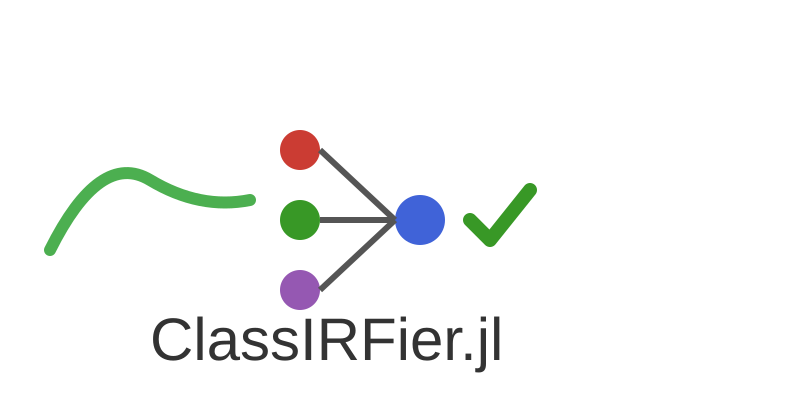

  

# ClassIRFier.jl

**ClassIRFier.jl** is a Julia package that uses neural networks to classify **Impulse Response Function (IRF)** shapes.  
It is designed to integrate seamlessly into **sign-restricted SVAR** workflows by providing an automated, consistent classifier for IRF patterns.

---

## 🔍 What it does

- Takes a vector or matrix of IRFs as input  
- Encodes their **shape features** via a small feed-forward network  
- Returns a **class label** or **similarity score**  
- Intended to be embedded inside IRF selection pipelines for **SVAR identification**  

ClassIRFier **does not compute IRFs**. It only learns to classify them.